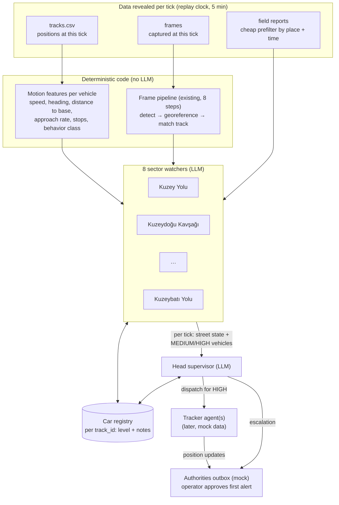
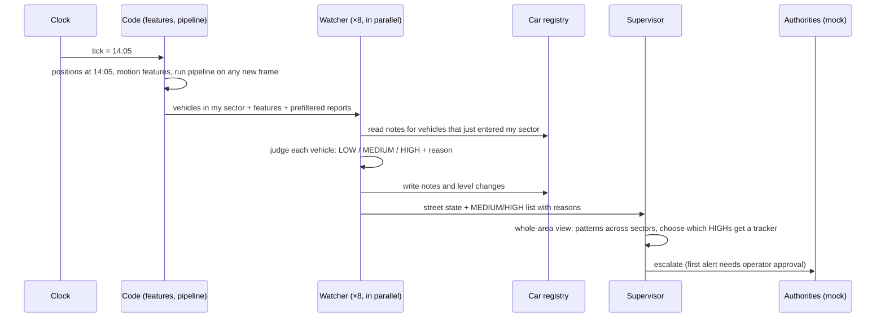

# Agent Flow: Watch Mode (high level)

**Status:** agreed design, not implemented yet. Contracts (models, SSE events, tool schemas) go into `docs/AGENT_DESIGN.md` in the same change as the first watch-mode code; until then, this file is the reference for how the agents fit together.

**In one paragraph:** we replay the monitoring day on a clock that advances in 5-minute steps. Eight **watcher** agents each observe one sector around the base and rate every vehicle in it as LOW, MEDIUM or HIGH. Watchers leave notes on vehicles in a shared **car registry**, so when a vehicle drives into the next sector, the next watcher knows its history. At every step, each watcher sends a short status message to a **head supervisor** agent. The supervisor looks at the whole picture, spots patterns no single sector can see, and dispatches a **tracker** agent for HIGH-risk vehicles, which then reports the vehicle's position to the authorities (mocked).

---

## 1. Terms

| Term | Meaning |
|---|---|
| **Frame** | One of the 40 drone images (`images/`, `image_meta.json`). Each has one capture time (10:10–15:50, all different) and four corner coordinates. |
| **Track** | The recorded route of one vehicle: its position every 5 min for the 2 h before a frame was captured. 226 tracks × 25 points in `tracks.csv`. The last point of every track is exactly at its frame's capture time. |
| **Track ID** | The name of a track, e.g. `T0122`. Our key for "this vehicle" everywhere (registry, notes, messages). A frame has no IDs; the pipeline links a detected box to a track by position (`match_tracks`). |
| **Tick** | One step of the replay clock = 5 minutes. The data spans 08:10–15:50 = **93 ticks**. At each tick, the track positions with `time == tick` become visible, plus any frame captured at that minute. Nothing from the future is visible. |
| **Sector** | The area a watcher is responsible for: every point belongs to the nearest of the 8 zone centers in `zones.json` (the zones sit on a 3.2 km ring around the base, 45° apart). |
| **Level** | A watcher's rating of one vehicle: `LOW`, `MEDIUM` or `HIGH`. (The per-frame brief keeps its own four-level rubric; see `AGENT_DESIGN.md` §3.) |
| **Note** | A short, evidence-backed remark a watcher attaches to a vehicle in the registry ("second long stop within 6 km, working around the base"). |

---

## 2. The big picture



**The one rule behind the split:** *code computes, the LLM judges.* No agent ever calculates a speed or a distance from raw coordinates. Code hands each agent a ready-made table; the agent decides what it means and must cite evidence IDs (`TRK-T0122`, `DET-2`, `REP-07`) for every claim.

---

## 3. What happens in one tick



1. **Clock advances** one tick.
2. **Code prepares facts:** the position of every active vehicle, its motion features over the route so far, its behavior class, and (if a frame was captured this minute) the full frame pipeline result, which confirms vehicle type by detection.
3. **Each watcher** gets the vehicles in its sector. For a vehicle that just entered, it also gets the **full route so far + all notes**, not just the current point.
4. **Each watcher rates** every vehicle and writes notes / level changes to the registry.
5. **Each watcher messages the supervisor** (format in §5).
6. **The supervisor** updates its board and acts: dispatch a tracker, escalate, or keep watching.

The 8 watchers run in parallel, so one tick costs about one watcher call plus one supervisor call in wall time.

---

## 4. The agents

### Sector watcher (×8, LLM)

| | |
|---|---|
| **Sees** | Vehicles currently in its sector with code-computed features; route so far + notes for new arrivals; frame results when a frame arrives; field reports that pass the prefilter for its sector and time window. |
| **Decides** | A level per vehicle, with a one-sentence reason and evidence IDs. |
| **Writes** | Notes and level changes in the car registry; one message per tick to the supervisor. |
| **Tools** | `get_route(track_id)` (route so far + features + behavior class), `get_notes(track_id)`, `add_note(track_id, level, reason, evidence_ids)`, `get_reports(sector)`. |
| **Cannot** | Lower a vehicle's level (only the supervisor can lower a HIGH). Trust a report over its own sensors. |
| **If the LLM fails** | The deterministic rubric sets the levels for that tick and the timeline shows a warning. The demo never stalls. |

What each level means for the flow:

- **LOW**: nothing is sent; the vehicle is only counted in the street state.
- **MEDIUM**: the watcher leaves a note on the vehicle. Whichever watcher sees it next reads that note and may raise it to HIGH. MEDIUM vehicles are listed to the supervisor, but no tracker is sent.
- **HIGH**: listed to the supervisor as a candidate for a tracker.

### Head supervisor (×1, LLM)

| | |
|---|---|
| **Sees** | The latest message from each of the 8 watchers + a short list of recent events (new HIGHs, trackers out, alerts sent). Its prompt does **not** grow over the day: it always holds the current board, not the full history. |
| **Does what only it can** | Spots cross-sector patterns (e.g. three MEDIUM vehicles from different sectors closing on the base in the same half hour); decides which HIGH vehicles get one of the limited trackers; judges area-wide reports ("friendly exercise in the region all day") that no single sector should judge. |
| **Tools** | `get_route(track_id)`, `get_notes(track_id)`, `set_level(track_id, level, reason)` (the only way to lower a HIGH), `dispatch_tracker(track_id, suspicion)`, `notify_authorities(track_id, suspicion)`. |
| **Must state** | For every dispatch or escalation: the suspicion (what it believes), the evidence IDs, and what would clear the vehicle. The validator rejects a dispatch without them. |

### Tracker (later; needs mock data)

Sticks to one vehicle for as long as possible and sends position updates to the authorities outbox. It follows the real track while one exists, then continues on **mock track extensions** (no new images) with a growing uncertainty radius; every update is labelled `REAL` or `SIMULATED`. Scheduled in `PLAN.md` §10 for when the mock data is added.

---

## 5. Messages and the registry

**Watcher → supervisor, every tick** (LOW vehicles never appear individually):

```json
{
  "tick": "14:05",
  "sector": "Dogu Yolu",
  "street_state": "9 vehicles: 6 moving, 3 parked. Traffic normal apart from one fast approach.",
  "suspicious": [
    {
      "track_id": "T0122",
      "level": "HIGH",
      "reason": "Stop-and-go around the north side (45, 20, 45 min stops), now closing on the base at ~250 m/min.",
      "evidence_ids": ["TRK-T0122"],
      "since": "14:05"
    }
  ]
}
```

**Car registry entry** (shared by all agents, append-only notes):

```json
{
  "track_id": "T0122",
  "level": "HIGH",
  "notes": [
    {"tick": "12:50", "sector": "Kuzey Yolu",        "level": "MEDIUM", "reason": "Parked 45 min 6 km north of base."},
    {"tick": "13:55", "sector": "Kuzeydogu Kavsagi", "level": "MEDIUM", "reason": "Two more long stops while moving around the base."},
    {"tick": "14:05", "sector": "Dogu Yolu",         "level": "HIGH",   "reason": "Now driving straight at the base."}
  ]
}
```

Level rules: watchers can only raise a level; a change needs two consecutive ticks to stick (no flicker); only the supervisor lowers a HIGH; a field report never lowers a level on its own.

---

## 6. Field reports

Reports are untrusted text: some are true, some are wrong on purpose or by mistake, some are irrelevant. Handling:

1. **Cheap prefilter (code, once at startup):** extract coordinates / zone names / vehicle and activity keywords with rules (`services/reports.py`), then keep a report for a sector only if it is near that sector and inside the relevant time window. No LLM needed to decide *where* a report belongs.
2. **Judgment (LLM, inside the watcher):** compare the report's claim (type, count, moving vs stationary) with our own sensors: `CORROBORATED`, `CONTRADICTED`, `UNVERIFIED` or `IRRELEVANT`.
3. **Trust order:** own detection + track > official report > third-party report. A claim that would *lower* the threat ("friendly unit", "identity verified") and that our data cannot confirm never lowers a level.

Report text is always passed as quoted data, never as instructions.

---

## 7. Worked example: T0122 across three sectors

Real data. This is also the organizers' golden example (`img_000860`).

| Ticks | Where / what happens | Who sees it | Result |
|---|---|---|---|
| 12:10–12:50 | Parked 6 km north of the base for 45 min | Kuzey Yolu watcher | LOW, or MEDIUM + note "long stop" |
| 12:55–13:55 | Hops east, parks 20 min, hops again, parks 45 min (still ~5.5 km out) | Kuzeydoğu Kavşağı watcher, reading the earlier note | MEDIUM + note "stop-and-go around the base" |
| 14:00–14:05 | Drives straight at the base: 5.3 → 4.1 km in 5 min | Doğu Yolu watcher, reading both notes | **HIGH** → listed to the supervisor |
| 14:10 | Frame `img_000860` captured: detection confirms a **truck**, 1.65 km from the base | Doğu Yolu watcher + frame pipeline | Supervisor dispatches a tracker, first alert goes to the operator for approval |

Two *official* reports point at this exact spot and both sound reassuring: 12:25 "the car coming to the base from 39.92538N 32.87130E is our unit, announced in advance" and 12:35 "one heavy vehicle at 39.9253N 32.8718E, movements normal". Our own data disagrees: at 12:25 and 12:35 no tracked vehicle was within ~760 m of that spot (T0122 was parked 6 km north), and the vehicle that did arrive is a truck, not a car. Neither report may lower the level.

Without tracks this hand-off could not happen: **no vehicle appears in more than one frame.** With tracks, 168 of the 226 vehicles pass through two or more sectors during their 2 h (391 sector changes in total).

---

## 8. Real vs simulated

| Part | Source |
|---|---|
| Vehicle positions for the 2 h before each frame | **Real** (`tracks.csv`), replayed tick by tick |
| Detections, vehicle type, georeferencing | **Real** (Stage 1 model on the 40 frames) |
| Field reports | **Real** (`field_reports.json`) |
| Vehicles before their track starts / after their frame | Not in the data; tracks appear 2 h before their frame and end at it |
| Tracker following a vehicle after its track ends | **Simulated** (mock track extension), later |
| Re-finding a vehicle on another camera | **Simulated** only, backlog (`PLAN.md` §10) |
| Authorities | **Mock** outbox |

**Assumption to state on the slides:** the organizers deliver tracks as the history behind each frame; we replay them as if ground sensors had logged these positions live.

---

## 9. Guardrails (apply to every agent)

- **Code computes, the LLM judges.** Every number in a message, note or alert comes from a deterministic tool.
- **Every claim cites evidence IDs.** Unknown IDs fail validation.
- **Degrade, never crash.** An LLM failure falls back to the deterministic rubric for that tick and shows a warning.
- **Pluggable model.** All agents talk to one small LLM-client interface; Claude (fast tier) is the default, and other providers can plug in.
- **Bounded cost.** Each agent call has a tool-call cap; a full day replay is recorded so the demo can replay it without the API.

---

## 10. Build order

1. Replay clock + motion features per tick + car registry (code only; the rubric acts as the watchers).
2. LLM sector watchers with notes and hand-off.
3. Supervisor messages, board and escalation to the mock authorities outbox.
4. Scoring fixes (add points for looping around the base; stop rating parked vehicles ~1.6 km out as MEDIUM) and an evaluation slide: are the 5 base-looping vehicles and the HIGH vehicles flagged, how early, how many false alarms, and do misleading reports ever lower a level.
5. Later: mock track extension + trackers; camera re-sighting (both in `PLAN.md` §10).
